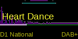

# dabble
A DAB radio project based on a PI, small LCD and some LED encoders. Very much a work in progress.

This project is targetted to be run on a Raspberry Pi running Raspberry OS (this could change). Assumptions reqarding packages etc 
rely on this. While the hardware could be run on another system using I2C and I2S I've not tested this. 

## Current progress and Features
- Forked and fixed dablin cli to output PAD announcements e.g. now playing
- UI seems stable

### Features
- DAB and DAB+ reception
- Station name scroll
- Ensemble displayed and DAB type
- Waveform visualiser works
- Graphic equaliser works




- PAD messages updated


- Station selection works
- Volume control works
- Station scanning works, although need to decide how to handle default list of channels to scan
- Also captures audio format but not currently displayed

## Current problems:
- Need another encoder as UI is difficult otherwise. Using keypresses to work around this
- Will need a menu system (using encoders) to nav settings etc
- Need to decide on audio output e.g. DAC or ??. Currently using HDMI
- Proper build perhaps into containers

## Ideas
- Want to stream to airplay/chromecast?? 
- Turn this into a mini streamer e.g. run shareport-sync et al?

## Components
- PI3 or greater. I'm currently using a PI5 which is probably overkill. Will probably try a Pi Zero W.
- [Pimoroni 0.96" LCD](https://shop.pimoroni.com/products/0-96-spi-colour-lcd-160x80-breakout). I got mine from PiHut.
- 1 x [LED encoders](https://shop.pimoroni.com/products/rgb-encoder-breakout) although I may change these to ones that include a button. But LEDS.... But switch!! Shame LED ones don't have a switch.
- RTLSDR (a cheap one will probably do, I'm using an official RTL-SDR.com v3). Move to Nano RTLSDR
- No idea about an enclosure yet. Will prototype it in thin MDF

## Software
- UI and controller written in python
- Modified version of of eti-cmdline from JvanKatwijk. Forked here https://github.com/lovemonkey257/eti-stuff
- Modified version of dablin from Opendigialradio, https://github.com/lovemonkey257/dablin

## Build
Ensure Raspberry Pi has SPI and I2C enabled in config

```
sudo raspi-config nonint do_spi 1
sudo raspi-config nonint do_i2c 1
sudo reboot
```

### `dablin`
Dependencies first.
- `sudo apt-get install libmpg123-dev libfaad-dev libsdl2-dev libgtkmm-3.0-dev libfdk-aac-dev`

Now the code (assumes using my fork. Hopefully they may include my PR):
- `sudo apt remove dablin`
- `git clone https://github.com/lovemonkey257/dablin.git`
- `cd dablin`
- `mkdir build && cd build && cmake ..`
- `make && sudo make install`

Note that dablin will be installed in /usr/local/bin/. System installed
version is in /usr/bin. Check you've removed system version if you have
problems with PAD.

### `eti-cmdline`
Dependencies:
- `sudo apt install build-essential cmake libfftw3f-dev libfftw3f libsamplerate0-dev librtlsdr-dev libspdlog-dev nlohmann-json3-dev libboost libboost-dev libfmt-dev libfmt9 jq`

Code. Most changes have been accepted upstream (thanks Jvan) so this is probably redundent:
- `git clone https://github.com/lovemonkey257/eti-stuff.git`
- `cd eti-stuff\eti-cmdline`
- `mkdir build && cd build`
- `cmake .. -DRTLSDR=ON`
- `make && sudo make install`

This should put `eti-cmdline-rtlsdr` into `/usr/local/bin`

### Python
As this needs system installed packages create requirements as follows:

`pip list --not-required --format=freeze -l > requirements.txt`

To install:
- `sudo apt install python3-alsaaudio python3-pyaudio`
- Create venv `pip -mvenv venv`
- Edit ./venv/pyvenv.cfg and ensure `include-system-site-packages` is `true`
- `pip install -r requirements.txt`

## Config
Saved state is saved into `dabble_radio.json" e.g.

```  
{
    "station_name": "Heart Dance",
    "ensemble": "D1 National",
    "volume": 34,
    "pulse_left_led_encoder": false,
    "pulse_right_led_encoder": false,
    "enable_visualiser": true,
    "visualiser": "waveform",
    "enable_levels": false
}
```
TODO: What else might need external configuration? Other config settings that should
be exposed?

## Running
- cd into your dev dir
- `source ./venv/bin/activate`
- `python radio.py`

## Use
To simulate multiple encoders I'm using keypresses. For examplei:

- Volume: press `v` then encoder changes volume
- Stations: press `s` then encoder steps through stations
- Scanning: press `S`
- Change visualiser: Press `g` for graphic equaliser, `w` for waveform


